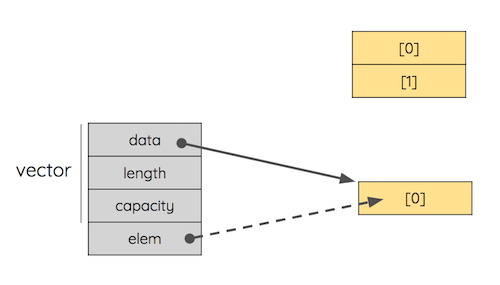
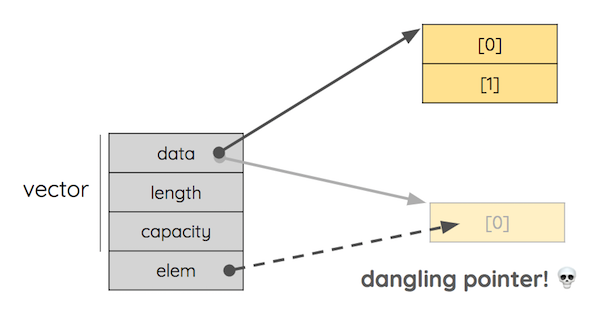

# Elixir NIFs with Mozilla Rust

---

## Greetings

---

## Have we ever meet? 
Have you ever worked with Mozilla Rust? 
And Elixir? 

---

## Why Elixir? 
* Powerful dynamic language
* Fast learning curve
* And...

---

## Because is designed for: 
- Easy **concurrency**
- **Fault tolerance**
- To be **maintainable**
- To be **scalable**
- To help you build **distributed applications**

---

## HOW?! 
Elixir runs on the Beam virtual machine

---

## The Beam 
* Light-weight process
* No memory sharing
* Code hot-swap out of the box
* Battle tested
* OTP: a powerful concurrency library 

---

## The Supervisor tree
 

---

## Fault Tolerance

---

## Genserver 
Genserver is abstraction around a process.
<pre>
<code data-trim="hljs elixir" class="lang-elixir">
defmodule TodoList do
  use GenServer
end
</code>
</pre>

---

<pre>
<code data-trim="hljs elixir" class="lang-elixir">
defmodule Todolist do
  use GenServer
  
  def start(list) do
    GenServer.start_link(__MODULE__, list, name: __MODULE__)
  end
 
  def list_tasks() do
    GenServer.call(__MODULE__, {:list})
  end
  
  def add_task(task) do
    GenServer.cast(__MODULE__, {:add, task})
  end
  
  def handle_cast({:add, task}, list) do
    {:noreply, [task | list]}
  end
  
  def handle_call({:list}, _from, list) do
    {:reply, list, list}
  end
end
</code>
</pre>

---

## What the Beam cannot do for you? 
- Specific hardware access
- Blowing fast sequential computation

---

## NIFs
NIFs stands for Native Implemented Functions.  
These are programs mostly written in C we can call from Beam.  
Once called, a NIF takes the full control of computation,  
run with speed of light and can do anything as native code can.  
Sounds great but...

---

## How to crash the world most stable virtual machine 

* Fill the *atoms* table (1 million)
* Overflow the binary space
* Process heap failures:
  + Infinite recursion that spawns infinite process
  + Super very long message queues
  + A tons of data
* And of course... __errors inside NIFs__

---

## So NIFs as only for superheroes?

---

## Why Mozilla Rust? 

---

### Rust is a system programming language pursuing the trifecta

- Safe
- Concurrent
- Fast

---

## Safety

* Memory Safe
* No Illegal memory access
* Automatic deallocation

---

## What Safety means?

<pre>
<code data-trim="hljs cpp" class="lang-cpp">
void example() {
  vector<string> vector;
  …
  auto& elem = vector[0];
  vector.push_back(some_string);
  cout << elem;
}
</code>
</pre>

 

---

## What Safety means?

<pre>
<code data-trim="hljs cpp" class="lang-cpp">
void example() {
  vector<string> vector;
  …
  auto& elem = vector[0];
  vector.push_back(some_string);
  cout << elem;
}
</code>
</pre>

 

---

## What Safety means?

<pre>
<code data-trim="hljs cpp" class="lang-cpp">
void example() {
  vector<string> vector;
  …
  auto& elem = vector[0];
  vector.push_back(some_string);
  cout << elem;
}
</code>
</pre>

 

---

## What Safety means?

Problem with safety happens when we have a resource that at the same time:

- has alias: more references to the resource
- is mutable: someone can modify the resource

That is (almost) the definition of data race.

    alias + mutable = 💀

---

## Concurrent

* Compile time errors for concurrent access to data
* Prevent data races
* "Fearless concurrency"

---

## Fast

* Safety without runtime costs 
* LLVM optimization
* Zero cost abstraction
* No GC

---

### The Rust Way (Key Concepts)

* Ownership
* Borrowing
* Lifetimes

---

## Ownership

- Each resource in Rust has one owner at time.
- When the owner goes out of scope, the resource will be dropped.
- Ownership can be transferred
- The owner can mutate the owned data

---

### Ownership Example

<pre>
<code data-trim="hljs rust" class="lang-rust">

fn main() {
    let mut vec = Vec::new();
    vec.push(1);
    take(vec);
}

fn take(vec : Vec&lti32&gt) {
    println!("{:?}", vec);
}
</code>
</pre>

---

### Ownership Example

<pre>
<code data-trim="hljs rust" class="lang-rust rust-interactive">

fn main() {
    let mut vec = Vec::new();
    vec.push(1);
    take(vec);
    take(vec);
}

fn take(vec : Vec&lti32&gt) {
    println!("{:?}", vec);
}
</code>
</pre>

---

## Borrowing

- Express shared reference to values
- Immutable/ Mutable references
- Mutable references are exclusive.

---

## Borrowing with &T 

<pre>
<code data-trim="hljs rust" class="lang-rust rust-interactive">

fn main() {
    let mut vec = Vec::new();
    vec.push(1);
    print(&vec);
    print(&vec);
}

fn print(vec : &Vec&lti32&gt) {
    println!("{:?}", vec);
}
</code>
</pre>

---

## Borrowing WITH  &mut T 

<pre>
<code data-trim="hljs rust" class="lang-rust rust-interactive">

fn main() {
    let mut vec = Vec::new();
    vec.push(1);
    print(&vec);
    push_two(&mut vec);
    print(&vec);
}

fn print(vec : &Vec&lti32&gt) {
    println!("{:?}", vec);
}
fn push_two(vec : &mut Vec&lti32&gt) {
    vec.push(2);
}
</code>
</pre>

---

## Lifetimes

- Lifetimes describe the time that values remain in memory
- A variable's lifetime begins when it is created and ends when it is destroyed
- In simplest cases, compiler recognize eventual problem (borrow checker) and refuse to compile.
- In more complex scenarios compiler needs an hint.

---

## Lifetimes example

<pre>
<code data-trim="hljs rust" class="lang-rust rust-interactive">

fn main() {
    let line = "lang:en=Hello World!";
    let v;
    {
        let p = "lang:en=";
        v = skip_prefix(line, p); 
    }
    println!("{}", v);
}

fn skip_prefix(line: &str, prefix: &str) -> &str {
    let (s1,s2) = line.split_at(prefix.len());
    s2
}

</code>
</pre>

---

## Lifetimes Fix example

<pre>
<code data-trim="hljs rust" class="lang-rust rust-interactive">

fn main() {
    let line = "lang:en=Hello World!";
    let v;
    {
        let p = "lang:en=";
        v = skip_prefix(line, p); 
    }
    println!("{}", v);
}

fn skip_prefix<'a>(line: &'a str, prefix: &str) -> &'a str {
    let (s1,s2) = line.split_at(prefix.len());
    s2
}

</code>
</pre>

---

## Other Key concepts

* No Exception (Result)
* No Null (Option)
* Structs
* Enum on steroids
* Pattern matching
* Generics
* Traits (Zero cost abstraction)

---

## Result type

Exceptions do not exist in Rust 

<pre>
<code data-trim="hljs rust" class="lang-rust">

enum Result&ltT, E&gt {
    Ok(T),
    Err(E),
}

fn main() {
    let x : Result&lti32,&str&gt = Ok(7);
    let y : Result&lti32,&str&gt = Err("Too bad");

    match x {
        Ok(n) => println!("{}",n),
        Err(e) => println!("{}",e)
    }
}

</code>
</pre>

---

## Option type

Null does not exist in Rust

<pre>
<code data-trim="hljs rust" class="lang-rust">

enum Option&ltT&gt {
	None,
	Some(T),
}

fn main() {
    let x = Some(7);
    let y : Option&lti32&gt = None;

    match x {
        Some(n) => println!("{}",n),
        None => println!("Not found")
    }
}

</code>
</pre>

---

## Why together? 
- 3D rendering
- Fast decoding/encoding
- GPU computation
- IOT
- Specific hardware access

---

## A Rusty NIF 

---

## Rustler

- A library for writing NIFs in Rust
- Handle encoding and decoding of Erlang terms (Interoperability)
- It should never be able to crash the BEAM (safety)
- Resource objects
- Easy to use

https://github.com/hansihe/rustler

---

## Getting Started
 
 
### $ mix new image

---

### mix.exs

<pre>
<code data-trim="hljs elixir" class="lang-elixir">
  defp deps do
    [
      {:rustler, "~> 0.16.0"}
    ]
  end
</code>
</pre>

---

<pre>
<code data-trim="hljs bash" class="lang-bash">
$ mix rustler.new
==> rustler
Compiling 2 files (.erl)
Compiling 6 files (.ex)
Generated rustler app
==> image
This is the name of the Elixir module the NIF module will be registered to.
Module name > Image
This is the name used for the generated Rust crate. The default is most likely fine.
Library name (image) > img
* creating native/img/README.md
* creating native/img/Cargo.toml
* creating native/img/src/lib.rs
Ready to go! 

</code>
</pre>

---

## Rustler compiler

<pre>
<code data-trim="hljs elixir" class="lang-elixir">

defmodule Image.MixProject do
  use Mix.Project

  def project do
    [
      app: :image,
      version: "0.1.0",
      elixir: "~> 1.6",
      compilers: [:rustler] ++ Mix.compilers,
      start_permanent: Mix.env() == :prod,
      rustler_crates: rustler_crates(),
      deps: deps()
    ]
  end

  ...
end

</code>
</pre>

---

## Crate Config

<pre>
<code data-trim="hljs elixir" class="lang-elixir">

  defp rustler_crates do
    [img: [
      path: "native/img",
      mode: rustc_mode(Mix.env)
    ]]
  end
  defp rustc_mode(:prod), do: :release
  defp rustc_mode(_), do: :debug

</code>
</pre>  

---

## Module definition

<pre>
<code data-trim="hljs elixir" class="lang-elixir">

defmodule Image do
  use Rustler, otp_app: :image, crate: "img"

  def add(_x,_y), do: err()

  defp err() do
    throw(NifNotLoadedError)
  end
end

</code>
</pre> 

---

## lib.rs

<pre>
<code data-trim="hljs rust" class="lang-rust">
#[macro_use] extern crate rustler;
#[macro_use] extern crate rustler_codegen;
#[macro_use] extern crate lazy_static;

use rustler::{NifEnv, NifTerm, NifResult, NifEncoder};

mod atoms {
    rustler_atoms! {
        atom ok;
    }
}

rustler_export_nifs! {
    "Elixir.Image",
    [("add", 2, add)],
    None
}

fn add&lt'a&gt(env: NifEnv&lt'a&gt, args: &[NifTerm&lt'a&gt]) -> NifResult&ltNifTerm<'a&gt&gt {
    let num1: i64 = args[0].decode()?;
    let num2: i64 = args[1].decode()?;

    Ok((atoms::ok(), num1 + num2).encode(env))
}

</code>
</pre> 

---

## Caveats

- Require Rust compiler
- NIF execution time

---

## Projects with Rustler

- Html5ever 
- Juicy
- Rox

---

## Thanks
